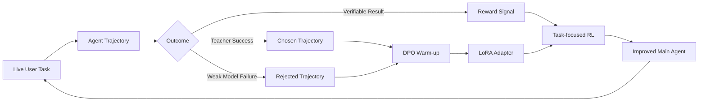

# 当本地小模型 Agent 做不好任务时，能不能让它持续变强？

很多人第一次接触 Agent 产品时，关注点通常是：

- 它能不能接入 WhatsApp、Telegram、Slack、微信等入口？
- 它能不能读文件、搜网页、写报告、操作浏览器？
- 它能不能长期运行，像一个真正的个人助理？

这些能力当然重要。但当 Agent 真正进入用户工作流之后，一个更现实的问题会很快出现：

> 如果用户的部署资源有限，只能本地运行 2B 或 4B 级别的小模型，而这个模型在某些真实任务上做不好，怎么办？

换一个更大的模型是一种答案，但并不总是可行。

在私有化、本地化、低成本部署场景里，用户往往同时需要几件事：

- 模型足够小，可以在本地机器或低成本 GPU 上运行；
- Agent 能接入真实工具、真实文件和真实工作流；
- 数据尽量不离开用户环境；
- 当某类任务失败时，系统能把失败经验转化成训练信号；
- 下一次再遇到类似任务，小模型真的能做得更好。

这正是 JiuwenClaw-RL 想解决的问题。

JiuwenClaw-RL 不是要把小模型包装成“万能大模型”。它更关注一个工程上更具体、也更可落地的问题：

> 面向真实用户工作流，如何让资源受限的小模型 Agent 针对某类任务持续补齐能力？

## 什么是 live-user 场景？

这里说的 live-user 场景，不是一个抽象概念。

它指的是：Agent 不是在离线 benchmark 里回答一道标准题，而是在用户真实工作区里，带着上下文、文件、工具和时间约束去完成一件事。

用户很少会说：

```text
请回答一个标准化测试问题。
```

用户更可能说：

```text
这个文件夹里有销售 CSV 和费用 Excel，帮我整理一份给老板看的经营摘要。
```

这类任务有几个特点：

- 状态是真实的：文件真的在 workspace 里，最终报告也必须真的写出来。
- 工具是真实的：模型需要调用 read、write、search、execute 等工具，而不是只生成一段文本。
- 过程是多轮的：一次任务通常包含观察、读取、计算、纠错、写入多个步骤。
- 失败是有代价的：如果模型只是口头说“我完成了”，但文件没有生成，对用户来说就是失败。
- 数据是用户自己的：很多场景不能把文件和上下文交给云端大模型，必须本地或私有化部署。

所以 live-user 场景里的 Agent，本质上是一个“在用户工作区里做事的执行系统”，而不是一个聊天框。

JiuwenClaw 的价值正在这里：它连接消息入口、本地 workspace、工具、session、memory 和执行轨迹，让 Agent 可以真正进入用户的工作流。

这类系统天然会产生一种非常宝贵的数据：真实执行轨迹。

一次 live-user Agent 任务里，模型会经历：

```text
用户目标
→ 观察 workspace
→ 调用工具
→ 读取文件
→ 处理异常
→ 写入结果
→ 得到任务反馈
```

这些轨迹比普通问答数据更有价值。因为它们记录的不是“模型知道什么”，而是“模型怎么做事”。

JiuwenClaw-RL 的核心想法就是：

> 把 live-user 场景中的执行轨迹，转化为小模型可学习的行为数据。

## 一个具体任务：让 Agent 稳定处理表格分析

我们用一个办公场景里的表格任务来说明。

任务要求 Agent 在 workspace 中读取两个文件：

```text
quarterly_sales.csv
company_expenses.xlsx
```

然后生成一份 Markdown 报告：

```text
data_summary.md
```

报告需要包含：

- 总收入；
- 利润；
- 表现最好的区域；
- 表现最好的产品；
- 费用分析；
- 预算差异。

这看起来像一个普通的办公自动化任务。但对小模型 Agent 来说，它并不简单。

它需要完成一段完整的工具使用流程：

```text
读取 CSV
读取 Excel
理解表结构
计算关键指标
避免无效重试
写入最终报告
```

在 Qwen3.5-2B base 上，我们观察到几个典型失败模式：

- 读到 `.xlsx` 后，把 Excel 当成二进制乱码反复读取；
- CSV 可以读取，但关键数字计算错误；
- 报告结构不完整；
- 没有真正写出 `data_summary.md`，只是口头说“已经完成”；
- 超过很多轮还在尝试无效操作。

这说明模型不是完全不会调用工具，而是缺少稳定的 Agent 工作流。

它需要学会的不是某个固定答案，而是一种行为策略：

> 什么时候读文件，什么时候停止无效尝试，什么时候计算，什么时候写报告。

## 为什么不是直接 SFT？

一种直觉做法是：让强模型做一遍，把成功轨迹拿来 SFT 小模型。

这个方法可以工作，但它也有明显风险。

对本地小模型来说，直接 SFT 容易带来两个问题：

- 模型可能记住模板，而不是真正学会任务族；
- 如果数据太窄，可能影响模型原本的通用行为，也就是常说的灾难性遗忘。

所以 JiuwenClaw-RL 采用的是更克制的两阶段方案：

```text
DPO warm-up
→ task-focused RL
```

并且训练方式采用 LoRA，而不是全参微调。

这样做的好处是：

- base model 权重不动；
- adapter 可以单独加载、卸载、回滚；
- 能力增强集中在特定任务族；
- 对原模型通用能力的扰动更小。

## 第一阶段：DPO warm-up，让小模型知道什么轨迹更好

DPO 阶段不要求小模型逐 token 模仿强模型。

我们构造的是偏好数据：

```text
同一个任务 prompt 下：
teacher 成功轨迹 > 小模型失败轨迹
```

具体来说，数据构造分三步。

第一步，用 teacher 生成成功轨迹。

例如使用 qwen3.6-plus 或 qwen-plus 多次执行 spreadsheet 任务，只保留高质量轨迹：

```text
score >= 0.9
assistant turns <= 8
成功生成 data_summary.md
关键数字正确
没有陷入 xlsx 乱码循环
```

第二步，用 2B base 收集失败轨迹。

让 Qwen3.5-2B 跑同一批任务，保留失败案例：

```text
score <= 0.5
目标文件不存在
关键指标缺失
反复读取 xlsx binary
数字严重错误
超过 10 turns 仍未完成
```

第三步，组成 DPO pair。

```json
{
  "prompt": "请读取 sales.csv 和 expenses.xlsx，并生成 data_summary.md",
  "chosen": "teacher 的成功工具调用轨迹",
  "rejected": "2B 模型的失败工具调用轨迹"
}
```

这个阶段让小模型学到的是偏好，而不是死记答案：

- 读到 Excel 异常时，不要无效循环；
- 必须真正写文件，而不是口头完成；
- 报告必须包含关键指标；
- 短而完整的轨迹优于长而无效的轨迹。

## 这是不是依赖强模型 teacher？

这个问题需要正面回答：是的，冷启动阶段会依赖强模型 teacher。

如果一个 2B 模型完全不知道某类任务应该怎么做，直接让它靠 RL 从零探索，效率会很低，也容易学到奇怪的 reward hacking。比如在 spreadsheet 任务里，它可能学会“口头说完成”，但没有真正写出 `data_summary.md`。

所以我们使用 qwen3.6-plus / qwen-plus 这类强模型做 DPO warm-up，让小模型先看到成功轨迹长什么样。

但这不等于 JiuwenClaw-RL 只是“大模型蒸馏小模型”。

更准确地说，JiuwenClaw-RL 使用三类训练信号：

- Teacher signal：强模型提供高质量成功轨迹，用于 cold start。
- Verifiable reward：任务结果可以自动验证，例如文件是否生成、数字是否正确、测试是否通过。
- Live-user feedback：用户是否采纳、是否修改、是否重试、是否给出反馈。

teacher 的作用更像点火器，而不是发动机。

```text
teacher 负责让小模型看到“可行解”
verifiable reward 负责判断“做没做对”
live-user feedback 负责告诉系统“用户是否真的满意”
```

在 spreadsheet demo 中，最关键的信号并不依赖 teacher：

```text
data_summary.md 是否存在
total revenue 是否正确
top region 是否正确
budget variance 是否正确
是否在合理 turn 数内完成
```

这些都可以由程序自动检查。

因此，我们不把这里的“进化”定义成“模型没有任何外部信号、凭空变强”。真实系统里的进化一定需要反馈。JiuwenClaw-RL 做的是把 teacher、可验证结果和用户反馈统一成训练信号，让部署中的小模型持续适应自己的任务环境。

## 第二阶段：task-focused RL，让模型在真实环境里稳定完成

DPO 之后，模型知道了“好轨迹更像什么”。

但 Agent 任务的关键不是离线模仿，而是在真实工具环境中稳定完成。

所以第二阶段进入 RL。

我们把 spreadsheet 任务做成一个可自动扩增的任务族：

```text
随机生成 CSV
随机生成 Excel
自动计算标准答案
自动生成任务 prompt
自动检查 data_summary.md
```

每个任务变体都自带标准答案：

```json
{
  "expected": {
    "total_revenue": 119900,
    "gross_profit": 47960,
    "top_region": "East",
    "top_product": "Widget B",
    "budget_variance": "..."
  }
}
```

RL reward 不只看最终文本，而是直接检查任务是否完成：

```text
+ 生成 data_summary.md
+ 总收入正确
+ 利润正确
+ top region 正确
+ top product 正确
+ 费用/预算分析完整
+ 合理 turn 数内完成
- 反复读取 xlsx binary
- 幻觉“已保存”但文件不存在
- 没有写目标文件
- 超过 turn 上限仍未完成
```

这样模型学到的不是“这个题的答案”，而是：

> 对一类表格分析任务，如何用工具稳定完成交付。

## 算法：面向 Agent 轨迹的 REINFORCE++ 改版

JiuwenClaw-RL 的 RL 部分参考了 REINFORCE++，但训练对象不是普通问答，而是 live-user Agent trajectory。

一次 rollout 不是生成一句答案，而是一段完整 Agent episode：

```text
assistant turn
→ tool call
→ tool result
→ assistant turn
→ tool call
→ final file
→ grader reward
```

我们对这个流程做了几类工程适配：

- 支持多轮工具调用；
- 支持 OpenClaw / JiuwenClaw runtime 中的真实 workspace；
- 支持 terminal reward 和 process reward；
- 支持 token-level reward 对齐；
- 支持 LoRA 训练；
- 支持 KL 约束，避免小模型行为漂移；
- 支持 DPO warm-up 后继续 RL。

训练目标不是让模型“更会聊天”，而是让它在真实工具链里更会完成任务。

## 为什么不是 GRPO？

GRPO 很适合一类场景：同一个 prompt 可以一次采样多条回答，然后用组内相对分数估计 advantage。

比如数学题、代码题、短问答任务，可以对同一道题采样 4 条、8 条甚至更多回答：

```text
同一个问题
→ 采样多条答案
→ 比较哪条更好
→ 用组内相对排名更新模型
```

但 live-user Agent 任务不太一样。

以 spreadsheet demo 为例，一次 rollout 不是一句回答，而是完整执行链路：

```text
读 CSV
→ 读 Excel
→ 计算指标
→ 写 data_summary.md
→ 检查文件和数字
```

如果对同一个任务做 GRPO 式多采样，就意味着同时跑多条完整 Agent trajectory。成本会迅速变高：

- 每条轨迹都会真实调用工具；
- 每条轨迹都会读写 workspace；
- 每条轨迹可能触发搜索、代码执行、文件操作；
- 多条轨迹之间还要隔离环境，避免互相污染；
- live-user 场景里用户通常等的是一次真实执行，不是离线批量采样。

因此，我们的训练更接近：

```text
每个任务 rollout.n = 1
拿到这一条真实执行轨迹
根据可验证结果和过程规则给 reward
用 reference/KL 控制模型不要漂移
```

这正是 REINFORCE++ 改版更适合的地方。

它不依赖同一 prompt 的多条组内样本，而是可以直接利用单条真实轨迹的 reward 信号：

```text
一个任务
→ 一条真实 Agent trajectory
→ 一个 terminal reward + process reward
→ 更新 LoRA policy
```

我们也做了 Agent 场景下的几处改造：

- 用 DPO warm-up 先把策略拉到“会做事”的区域，减少纯 RL 探索成本；
- 用 terminal reward 判断最终交付是否成立，例如 `data_summary.md` 是否存在、数字是否正确；
- 用 process reward 惩罚无效循环，例如重复读取 xlsx 乱码；
- 用 KL 约束参考模型，避免小模型为了单一任务过度漂移；
- 用 LoRA adapter 训练，保证能力增强可加载、可卸载、可回滚。

所以这里不是说 GRPO 不好，而是任务形态不同：

```text
离线短答案、多采样、组内比较：GRPO 很合适
live-user 长任务、工具调用、单轨迹可验证：REINFORCE++ 改版更直接
```

## 为什么这对本地小模型重要？

大模型可以靠规模覆盖很多复杂行为。

但本地部署经常不是这个条件：

- 显存有限；
- 推理成本敏感；
- 数据不能出本地；
- 用户希望长期运行；
- Agent 需要接入真实文件和本地工具。

这时 2B / 4B 模型很有价值，但它们经常卡在长任务执行上。

JiuwenClaw-RL 的意义在于：

> 不要求每个部署都换成更大的模型，而是允许用户把真实失败任务变成训练信号，给自己的小模型补能力。

在 spreadsheet 任务里，2B base 经常出现读表失败、数字不准、报告不完整等问题。经过 DPO warm-up 和 task-focused RL 后，目标是让这类任务从“偶尔做对”变成“稳定完成”，并尽量控制在合理 turn 数内。

这类提升对真实用户是可感知的：

```text
以前：读到 Excel 就卡住，报告数字不可靠
之后：能读表、算数、写文件，产出可交付报告
```

## 数据扩增模块：把任务变成训练飞轮

JiuwenClaw-RL 里最关键的不是某个单独算法，而是数据扩增模块。

它把一个失败任务变成一组可训练数据：

```text
任务变体生成
→ teacher 成功轨迹
→ 弱模型失败轨迹
→ DPO 偏好对
→ RL 自动评分环境
→ 小模型能力增强
```

这个模块可以持续工作：

- 用户发现某类任务做不好；
- 系统生成相似任务变体；
- teacher model 提供成功轨迹；
- 当前小模型暴露失败轨迹；
- DPO 学偏好；
- RL 在真实工具环境中优化；
- 新 adapter 回到 JiuwenClaw runtime 中服务用户。

这就是面向 live-user Agent 的反馈驱动学习闭环。它不是无中生有的“自我进化”，而是把 teacher、可验证 reward 和用户反馈都纳入同一个持续学习系统。

## 不是替代 Skills，而是补足主 Agent 的动态能力

JiuwenClaw 已经支持 skills、tools、workspace、memory 等外显能力。

Skills 很重要。它们适合把明确流程固化下来。

但真实用户任务里，总会出现一些动态判断：

- 当前文件能不能直接读？
- 工具失败后是否该换策略？
- 什么时候继续搜索，什么时候停止？
- 什么时候应该写最终结果？
- 如何在有限 turn 内完成？

这些不是单个 skill 能完全解决的。

JiuwenClaw-RL 补的是主 Agent 的策略能力：

> Skills 让 Agent 多了工具，RL 让 Agent 更会使用工具。

## 小结

JiuwenClaw-RL 关注的不是离线榜单上的一次性分数，而是 live-user 场景里更实际的问题：

> 当本地小模型在某类真实任务上做不好时，能不能用真实轨迹让它变强？

我们的答案是：

```text
可以。
通过 DPO warm-up + task-focused RL，
把 teacher 成功经验、弱模型失败经验和可验证 reward 结合起来，
让 2B/4B 小模型逐步获得更稳定的 Agent 执行能力。
```

在 spreadsheet demo 中，这意味着小模型从“读表失败、数字不准、不会写报告”，逐步提升到“能读取数据、计算指标、生成可交付 Markdown 报告”。

这不是让小模型变成万能大模型。

而是让每个 JiuwenClaw 部署，都能围绕自己的真实任务，利用可验证反馈训练出更适合自己的主 Agent。

---

## 可配图建议

### 图 1：JiuwenClaw-RL 数据飞轮



### 图 2：Spreadsheet 任务前后对比

```text
Before RL:
read xlsx -> binary garbage -> retry -> retry -> wrong numbers -> incomplete report

After RL:
read csv -> read xlsx -> compute metrics -> write data_summary.md -> verified success
```

### 图 3：训练数据构造

```text
qwen3.6-plus successful trajectory
        >
Qwen3.5-2B failed trajectory

same prompt, different behavior, DPO learns the preference
```
