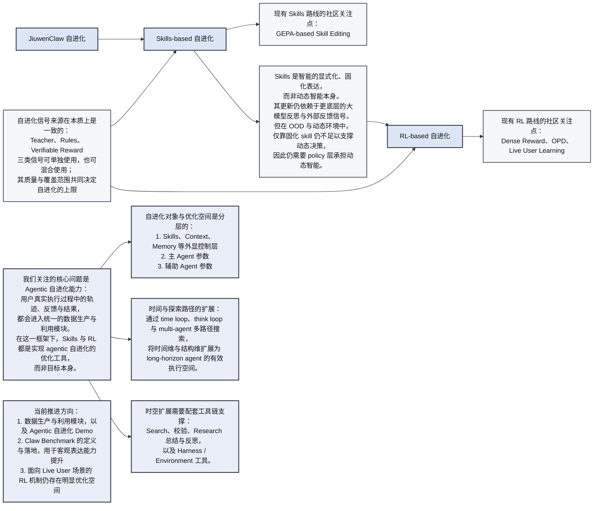

# JiuwenClaw：自进化框架（Mermaid）

在 Markdown 预览或 [mermaid.live](https://mermaid.live) 中渲染下图。

```mermaid
flowchart LR
    A["JiuwenClaw 自进化"] --> B["Skills-based 自进化"]

    E["自进化信号来源在本质上是一致的：<br/>Teacher、Rules、Verifiable Reward<br/>三类信号可单独使用，也可混合使用；<br/>其质量与覆盖范围共同决定自进化的上限"] --> B
    E --> F["RL-based 自进化"]

    B --> C["现有 Skills 路线的社区关注点：<br/>GEPA-based Skill Editing"]
    B --> D["Skills 是智能的显式化、固化表达，<br/>而非动态智能本身。<br/>其更新仍依赖于更底层的大模型反思与外部反馈信号。<br/>但在 OOD 与动态环境中，仅靠固化 skill 仍不足以支撑动态决策，<br/>因此仍需要 policy 层承担动态智能。"]

    D --> F
    F --> G["现有 RL 路线的社区关注点：<br/>Dense Reward、OPD、Live User Learning"]

    H["我们关注的核心问题是 Agentic 自进化能力：<br/>用户真实执行过程中的轨迹、反馈与结果，<br/>都会进入统一的数据生产与利用模块。<br/>在这一框架下，Skills 与 RL 都是实现 agentic 自进化的优化工具，<br/>而非目标本身。"] --> I["自进化对象与优化空间是分层的：<br/>1. Skills、Context、Memory 等外显控制层<br/>2. 主 Agent 参数<br/>3. 辅助 Agent 参数"]

    H --> J["时间与探索路径的扩展：<br/>通过 time loop、think loop 与 multi-agent 多路径搜索，<br/>将时间维与结构维扩展为 long-horizon agent 的有效执行空间。"]

    H --> K["时空扩展需要配套工具链支撑：<br/>Search、校验、Research 总结与反思，<br/>以及 Harness / Environment 工具。"]

    L["当前推进方向：<br/>1. 数据生产与利用模块，以及 Agentic 自进化 Demo<br/>2. Claw Benchmark 的定义与落地，用于客观表达能力提升<br/>3. 面向 Live User 场景的 RL 机制仍存在明显优化空间"]

    style A fill:#DCE6F5,stroke:#2F3542,stroke-width:2px,color:#111
    style B fill:#DCE6F5,stroke:#2F3542,stroke-width:2px,color:#111
    style F fill:#DCE6F5,stroke:#2F3542,stroke-width:2px,color:#111

    style H fill:#E9EEF8,stroke:#2F3542,stroke-width:2px,color:#111
    style I fill:#E9EEF8,stroke:#2F3542,stroke-width:2px,color:#111
    style J fill:#E9EEF8,stroke:#2F3542,stroke-width:2px,color:#111
    style K fill:#E9EEF8,stroke:#2F3542,stroke-width:2px,color:#111
    style L fill:#E9EEF8,stroke:#2F3542,stroke-width:2px,color:#111

    style C fill:#F5F7FB,stroke:#2F3542,stroke-width:1.5px,color:#111
    style D fill:#F5F7FB,stroke:#2F3542,stroke-width:1.5px,color:#111
    style E fill:#F5F7FB,stroke:#2F3542,stroke-width:1.5px,color:#111
    style G fill:#F5F7FB,stroke:#2F3542,stroke-width:1.5px,color:#111
```
