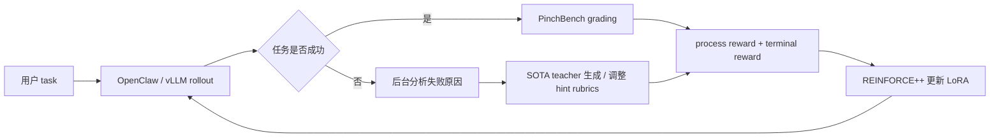

# PinchBench-OpenClaw 在线RL(LoRA) 实验报告 20260413

## 一、Benchmark 背景

PinchBench-RL8 是从 PinchBench 中筛选出的 8 个典型任务，专门用于评估 OpenClaw runtime 下的真实用户任务完成能力。它们覆盖了工具调用、文件操作、信息检索、结构化分析、记忆持久化和多轮任务推进等场景。选择这 8 题的原因是：`qwen-plus` 在这些任务上明显强于原始 `Qwen/Qwen3-4B`，因此它们既有区分度，也适合用来验证在线 RL 微调是否真的带来提升。

| 任务 | qwen-plus | Qwen3-4B baseline | RL LoRA |
|---|---:|---:|---:|
| `task_02_stock`               | 100%      | 67%               | 92%     |
| `task_10_workflow`            | 87.9%     | 33%               | 77%     |
| `task_12_skill_search`        | 100%      | 0%                | 17%     |
| `task_16_email_triage`        | 89.1%     | 39%               | 89%     |
| `task_18_market_research`     | 88.0%     | 34%               | 79%     |
| `task_18_spreadsheet_summary` | 97.5%     | 20%               | 2.5%    |
| `task_22_second_brain`        | 100%      | 0%                | 100%    |
| `task_24_polymarket_briefing` | 58.3%     | 12%               | 54%     |
| **总分** | **90.1%** | **50.4%** | **63.8%** |

其中，`task_18_spreadsheet_summary` 是本轮 LoRA 唯一明显退化的任务。主要原因是模型没有稳定学会对 `.xlsx` 进行结构化解析，而是把 Excel 文件当成二进制文本读取，导致统计指标、报告文件和分析结论都没有正确产出。这个问题说明 LoRA 已经学到部分工具推进能力，但在表格类结构化文件解析上仍然不稳定。

## 二、实验目标

1. 确认 `REINFORCE++` 在线训练能够稳定收敛。
2. 确认当前 reward 机制是合理的，能够带来正向提升。
3. 在 veRL 上以 OpenClaw 作为统一 runtime，模拟真实 live-user 场景，保证训练和推理 runtime 一致。

## 三、算法设计

### 1. 训练范式

本实验采用的是：

- `REINFORCE++ + LoRA`
- 基座模型：`Qwen/Qwen3-4B`
- 推理与训练均基于 OpenClaw 多轮 agent 环境
- 任务集固定为 8 个 RL8 task

与传统静态 SFT 不同，这套方案是在线交互式 RL：

- 模型先在任务环境中 rollout
- 根据任务完成情况和过程表现计算 reward
- 再反向更新 LoRA 参数

### 2. Reward 设计

本次采用的 reward 结构是：

- **process reward**：由 `self-judge` 根据 rubric 对每个 turn 的行为进行打分
- **terminal reward**：由 PinchBench 最终 grading 给出，通过/失败决定正负终局奖励

最终训练信号是：

- `self-judge + terminal reward`

这样设计的目的，是让模型既学会“任务推进过程”，又不会忽视最终结果。

### 3. 关键算法选择

采用 `REINFORCE++` 的原因是：

- 适合在线 rollout 场景
- 不依赖单独 critic 网络
- 通过 running mean baseline 降低方差
- 更适合当前这种多轮工具调用任务

相比 GRPO，这种方式更直接，便于调试 reward 和行为轨迹，也更适合先把“能做对”这件事跑通。

下面这张图概括了训练闭环：

这个闭环想表达的是：

- 用户 task 在 OpenClaw runtime 中执行
- 如果任务失败，系统会从轨迹和 grading 结果里分析问题，并由 SOTA teacher 生成 / 调整 hint rubrics
- 分析结果会反哺 rubric / hint 设计
- 最终 reward 再驱动 LoRA 更新
- 新的 LoRA 再进入下一轮 rollout

## 四、实现要点

### 1. Rubric 设计

本轮实验将 rubric 设计为 `self-judge process reward rubric`，用于对每个 turn 的行为进行过程打分，并在任务失败后形成反思总结和启发式 hint，反哺下一轮训练。

- 从“流程脚本”改成“进步信号判分卡”
- 强调：
  - 先工具后回答
  - 先验证再结论
  - 先读真实文件/真实数据再生成结果
- 弱化固定路径约束，避免模型只学表面流程
- 将失败案例总结为 hint，帮助后续 rollout 更快找到正确方向

其中重点加强的任务包括：

- `task_10_workflow`
- `task_18_spreadsheet_summary`
- `task_18_market_research`
- `task_24_polymarket_briefing`

### 2. 训练与评测口径对齐

为了确保结果可信，本实验强调训练与推理 runtime 一致性：

- 训练和评测使用同一套任务 prompt
- baseline、LoRA、训练验证都走同一套 RL8 task 集
- 训练、推理、benchmark 共享同样的 OpenClaw runtime 和服务链路
- 避免了之前由于模型服务地址、隧道端口错误造成的假失败

### 3. 训练参数设置

最终正式训练配置为 3 个 epoch，也就是每个样本只 finetune 了 3 次：

- `TOTAL_EPOCHS=3`
- `BATCH_SIZE=2`
- `TEST_FREQ=4`，即每个 epoch 验一次
- `SAVE_FREQ=4`，即每个 epoch 存一次
- `TRAINER_RESUME_MODE=disable`
- `PINCHBENCH_BEST_CKPT=1`

这样做的好处是：

- 训练轮次清晰，便于解释“每个样本只训练了 3 次”
- 每个 epoch 都能看到 validation 变化
- checkpoint 保存节奏清晰

## 五、实验结果

### 1. Baseline 结果

原始 `Qwen/Qwen3-4B` 最新有效 baseline：

- **50.4% (4.03 / 8.0)**

### 2. LoRA 结果

训练 3 个 epoch 后，`global_step_12` 的 LoRA 结果为：

- **63.8% (5.11 / 8.0)**

### 3. 总体提升

相较于 baseline：

- **绝对提升：+13.4 个百分点**
- 说明 LoRA 在线强化学习训练**确实带来了明显收益**

这次实验的核心结论可以直接写成：

> 在相同 RL8 任务集和统一评测口径下，经过 3 epoch 在线 RL 训练后，Qwen3-4B + LoRA 的总分从 50.4% 提升到 63.8%，取得了显著提升。

### 4. 逐题结果对比

| 任务                            | baseline | LoRA step 12 |
| ----------------------------- | -------- | ------------ |
| `task_02_stock`               | 67%      | 92%          |
| `task_10_workflow`            | 33%      | 77%          |
| `task_12_skill_search`        | 0%       | 17%          |
| `task_16_email_triage`        | 39%      | 89%          |
| `task_18_market_research`     | 34%      | 79%          |
| `task_18_spreadsheet_summary` | 20%      | 2.5%         |
| `task_22_second_brain`        | 0%       | 100%         |
| `task_24_polymarket_briefing` | 12%      | 54%          |

其中，`task_18_spreadsheet_summary` 是本轮 LoRA 唯一明显退化的任务。原因是模型没有稳定学会对 `.xlsx` 进行结构化解析，而是把 Excel 文件当成二进制文本读取，导致统计指标、报告文件和分析结论都没有正确产出。也就是说，这轮 LoRA 已经学到部分工具推进能力，但在表格类结构化文件解析上仍然不稳定。

## 六、结果分析

### 1. 提升是实质性的

这次 LoRA 不是单点偶然上升，而是多项任务一起变好。

### 2. 模型主要学会了什么

模型明显增强了：

- 用工具推进任务
- 多轮交互中保持目标
- 记忆类任务的跨 session 恢复
- 结构化整理和输出结果

### 3. 仍有短板

当前最不稳定的是：

- `task_12_skill_search`
- `task_18_spreadsheet_summary`

说明模型在多文件修改、以及 Excel / CSV 结构化解析这两类任务上还需要继续补强。

## 七、工程结论

除了训练收益，本次实验还验证了整套系统的可运行性：

- benchmark 隧道与服务端口已统一
- 原始模型与 LoRA 模型都能正确调用
- checkpoint 现在可以正常保留 best / latest
- TensorBoard 与训练日志可正常查看
- 训练、验证、保存、评测流程均已跑通

这意味着：

- 后续可以稳定继续做更长轮次的在线 RL 实验
- 也可以围绕弱项任务进一步做数据扩增和 rubrics 调整

## 八、最终结论

本次实验证明：

1. `REINFORCE++ + LoRA` 在线强化学习方案是有效的；
2. 在统一的 RL8 benchmark 下，模型总分从 **50.4%** 提升到 **63.8%**；
3. 说明训练不是只学到了形式化回答，而是真的提升了部分任务完成能力；
4. 当前主要短板集中在文件操作与表格解析两类任务，后续仍有继续提升空间。

需要说明的是，这次实验更偏向一个 toy example，主要验证的是算法和工程链路的可执行性。当前结论仍然依赖较小规模的 RL8 任务集，后续还需要在更大规模训练和更泛化的 benchmark 上继续验证。

**一句话总结：**

> 这轮实验结果明确证明了：通过针对性 rubric 设计、reward 重构和在线 LoRA 训练，Qwen3-4B 在 RL8 任务集上的综合表现获得了实质性提升。
