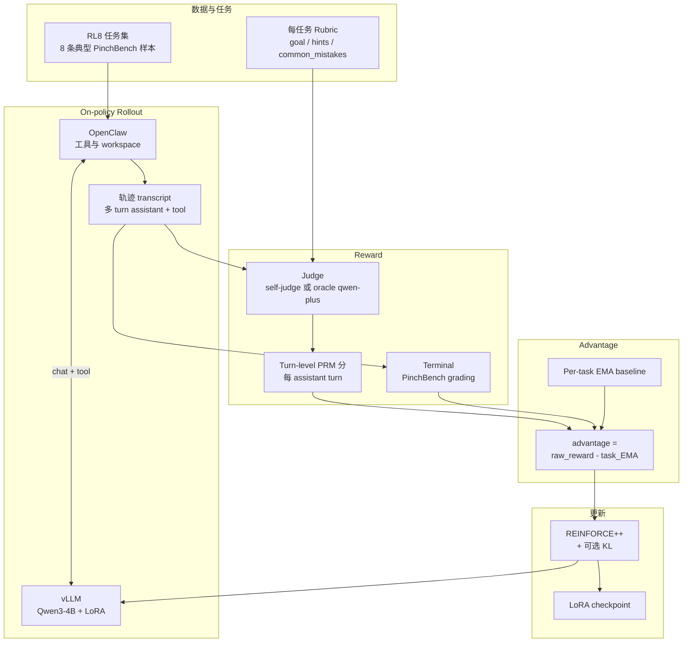

# PinchBench RL8：训练闭环（Mermaid）

在 Cursor / GitHub / VS Code Markdown 预览中打开本文件即可渲染下图。若需导出 PNG，可用 [Mermaid Live Editor](https://mermaid.live) 粘贴代码块内容。

---

## 单轮训练数据流

```mermaid
flowchart TB
  subgraph data["数据与任务"]
    RL8["RL8 任务集\n8 条典型 PinchBench 样本"]
    Rubric["每任务 Rubric\ngoal / hints / common_mistakes"]
  end

  subgraph rollout["On-policy Rollout"]
    OC["OpenClaw\n工具与 workspace"]
    VLLM["vLLM\nQwen3-4B + LoRA"]
    RL8 --> OC
    OC <-->|"chat + tool"| VLLM
    OC --> Traj["轨迹 transcript\n多 turn assistant + tool"]
  end

  subgraph reward["Reward"]
    Judge["Judge\nself-judge 或 oracle qwen-plus"]
    PRM["Turn-level PRM 分\n每 assistant turn"]
    Term["Terminal\nPinchBench grading"]
    Rubric --> Judge
    Traj --> Judge
    Judge --> PRM
    Traj --> Term
  end

  subgraph adv["Advantage"]
    EMA["Per-task EMA baseline"]
    A["advantage =\nraw_reward - task_EMA"]
    PRM --> A
    Term --> A
    EMA --> A
  end

  subgraph update["更新"]
    RPP["REINFORCE++\n+ 可选 KL"]
    CKPT["LoRA checkpoint"]
    A --> RPP
    RPP --> VLLM
    RPP --> CKPT
  end
```

