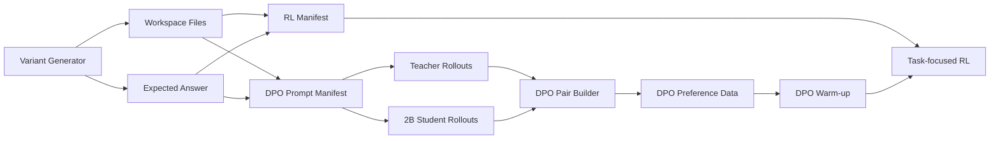

# Spreadsheet 数据生产模块设计

## 背景

当前 `task_18_spreadsheet_summary` 只有一条测试任务，不能直接拿这一条数据反复训练。这样做会有两个问题：

- 模型可能记住单题模板，而不是学会 spreadsheet task family。
- 训练集和测试集重合，demo 分数没有说服力。

因此需要一个训练数据生产模块，批量生成同构但不同数字、不同文件内容的 spreadsheet 任务，用于：

- DPO warm-up：teacher 成功轨迹 vs 2B 失败轨迹。
- task-focused RL：在可验证环境中强化文件生成、数字准确和少 turn 完成。

目标任务仍然围绕 `task_18_spreadsheet_summary`：

```text
读取 quarterly_sales.csv
读取 company_expenses.xlsx
计算销售和费用指标
写出 data_summary.md
```

## 设计原则

- **不是复制测试题**：生成多组不同 CSV/XLSX，保留任务结构，但数字和细节变化。
- **可自动评分**：每个 variant 都带标准答案，不依赖人工 judge。
- **DPO 和 RL 共用数据底座**：同一批 task variants 同时可用于 teacher/student rollout 和 RL 环境。
- **保留 live-user 任务形态**：每个样本都有 workspace 文件，模型必须真实读写文件。
- **支持 held-out 验证**：生成 train/val split，避免只证明原题过拟合。

## 数据流



## 代码入口

### 1. Variant generator

文件：

```text
rl/data_construction/task_variants/task_18_spreadsheet_summary.py
```

它负责生成：

- `quarterly_sales.csv`
- `company_expenses.xlsx`
- prompt
- expected answer

当前已支持 prompt variants，避免只训练单一 prompt 模板。每条样本按 `variant_seed` 确定一种表达，数据和 expected answer 仍保持可复现。

当前 prompt variants：

```text
canonical
manager_report
ops_finance_brief
file_delivery
analyst_task
```

这些 prompt 只改变用户表达方式，不改变任务契约：

```text
输入文件：quarterly_sales.csv + company_expenses.xlsx
输出文件：data_summary.md
核心指标：sales metrics + expense/budget metrics
```

每个 variant 的标准答案包含：

```json
{
  "target_file": "data_summary.md",
  "csv": {
    "total_revenue": 119900,
    "total_profit": 47960,
    "total_units_sold": 7210,
    "top_region_by_revenue": "East",
    "top_product_by_revenue": "Widget B"
  },
  "excel": {
    "total_q1_expenses": 10240,
    "department_highest_expenses": "Engineering",
    "employee_highest_expenses": "Alice Chen",
    "budget_comparison": {
      "Engineering": {
        "actual_expenses": 4100,
        "q1_budget": 9000,
        "variance": 4900,
        "status": "under_budget"
      }
    }
  }
}
```

### 2. Dataset builder

文件：

```text
rl/data_construction/build_spreadsheet_dataset.py
```

用途：把 synthetic variants 落盘成 workspace 和 JSONL manifest。

示例：

```bash
python3 rl/data_construction/build_spreadsheet_dataset.py \
  --output-dir rl/data/generated/task_18_spreadsheet_summary \
  --train 80 \
  --val 20 \
  --seed 20260418
```

输出：

```text
rl/data/generated/task_18_spreadsheet_summary/
  summary.json
  manifest.jsonl
  rl_train.jsonl
  rl_val.jsonl
  dpo_prompts_train.jsonl
  dpo_prompts_val.jsonl
  workspaces/
    train/
      task_18_spreadsheet_summary-train-0000-seed.../
        quarterly_sales.csv
        company_expenses.xlsx
    val/
      ...
```

### 3. DPO pair builder

文件：

```text
rl/data_construction/build_dpo_pairs.py
```

用途：把 teacher rollouts 和 student rollouts 配成 DPO preference pairs。

输入 rollout JSONL 约定：

```json
{
  "variant_id": "task_18_spreadsheet_summary-train-0000-seed123",
  "model": "qwen3.6-plus",
  "score": 1.0,
  "assistant_turns": 4,
  "transcript_path": "rollouts/teacher/xxx.jsonl",
  "messages": []
}
```

配对规则：

- chosen：teacher score >= 0.9 且 assistant_turns <= 8。
- rejected：student score <= 0.5。
- 同一个 `variant_id` 内配对。

示例：

```bash
python3 rl/data_construction/build_dpo_pairs.py \
  --prompts rl/data/generated/task_18_spreadsheet_summary/dpo_prompts_train.jsonl \
  --teacher-rollouts rl/data/generated/task_18_spreadsheet_summary/teacher_rollouts_train.jsonl \
  --student-rollouts rl/data/generated/task_18_spreadsheet_summary/student_rollouts_train.jsonl \
  --output rl/data/generated/task_18_spreadsheet_summary/dpo_pairs_train.jsonl
```

### 4. Runtime rollout collector

文件：

```text
rl/data_construction/collect_spreadsheet_runtime_rollouts.py
```

用途：这是正式 DPO 数据的主路径。所有 chosen/rejected 都必须先经过真实 runtime，保证训推一致。

核心原则：

```text
训练看到的 trajectory 必须来自推理时同一个 runtime：
same prompt
same workspace files
same OpenClaw/JiuwenClaw tools
same tool-call protocol
same transcript format
```

采集方式：

```text
teacher rollout:
  model = qwen-plus / qwen3.6-plus
  runtime = OpenClaw 或 JiuwenClaw runtime
  输入 = synthetic spreadsheet variant workspace
  输出 = runtime transcript + workspace result + dynamic grade

student rollout:
  model = Qwen3-1.7B base / current LoRA
  runtime = 同一个 runtime
  输入 = 同一个 synthetic spreadsheet variant workspace
  输出 = runtime transcript + workspace result + dynamic grade
```

动态评分不使用原始 `task_18_spreadsheet_summary` 的写死数字，而是使用每个 synthetic variant 自己的 `expected`：

```text
target_file_exists
csv_total_revenue_correct
csv_total_profit_correct
csv_total_units_correct
csv_top_region_correct
csv_top_product_correct
excel_total_q1_expenses_correct
excel_top_department_correct
excel_top_employee_correct
budget_comparison_present
no_repeated_xlsx_binary_read
used_execute_after_xlsx
```

Prompt variant 不需要对应写多套 grader/rubric。原因是 prompt 只改变用户表达方式，任务契约不变：

```text
输入文件固定为 quarterly_sales.csv + company_expenses.xlsx
交付文件固定为 data_summary.md
核心指标固定为 sales metrics + expense/budget metrics
每条样本的正确数字来自该 variant 的 expected
```

因此 grader 必须是 prompt-invariant、expected-driven：

```text
不要检查“是否复述了某个 prompt 里的措辞”
只检查 runtime 最终产物和轨迹行为是否满足任务契约
```

如果后续加入 LLM judge，judge rubric 也应描述任务族能力，而不是引用某个具体 prompt 模板：

```text
是否正确解析 CSV/XLSX
是否计算关键统计
是否写出 data_summary.md
是否避免重复读取 xlsx binary
是否给出清晰的 markdown 报告
```

示例命令：

```bash
python3 rl/data_construction/collect_spreadsheet_runtime_rollouts.py \
  --input rl/data/generated/task_18_spreadsheet_summary/rl_train.jsonl \
  --output rl/data/generated/task_18_spreadsheet_summary/runtime_teacher_rollouts_train.jsonl \
  --role teacher \
  --model qwen-plus \
  --limit 20

python3 rl/data_construction/collect_spreadsheet_runtime_rollouts.py \
  --input rl/data/generated/task_18_spreadsheet_summary/rl_train.jsonl \
  --output rl/data/generated/task_18_spreadsheet_summary/runtime_student_rollouts_train.jsonl \
  --role student \
  --model Qwen3-1.7B \
  --base-url http://127.0.0.1:18024/v1 \
  --api-key dummy \
  --limit 20
```

输出：

```text
runtime_teacher_rollouts_train.jsonl
runtime_student_rollouts_train.jsonl
runtime_transcripts/teacher/...
runtime_transcripts/student/...
```

然后再配 DPO pair：

```bash
python3 rl/data_construction/build_dpo_pairs.py \
  --prompts rl/data/generated/task_18_spreadsheet_summary/dpo_prompts_train.jsonl \
  --teacher-rollouts rl/data/generated/task_18_spreadsheet_summary/runtime_teacher_rollouts_train.jsonl \
  --student-rollouts rl/data/generated/task_18_spreadsheet_summary/runtime_student_rollouts_train.jsonl \
  --output rl/data/generated/task_18_spreadsheet_summary/runtime_dpo_pairs_train.jsonl
```

正式筛选规则：

```text
chosen:
  teacher score >= 0.9
  assistant_turns <= 8 或 <= 10
  data_summary.md exists
  CSV/Excel 关键数字正确
  no repeated xlsx binary read

rejected:
  student score <= 0.5
  或 target file missing
  或关键数字错误
  或 repeated xlsx binary read
  或没有 compute statistics
```

这个路径产出的 `runtime_dpo_pairs_*.jsonl` 才是主训练数据。

### 5. OpenClaw provider patch

文件：

```text
scripts/lib_agent.py
```

为 runtime DPO 采集修了 OpenClaw provider/model 映射。原因是 OpenClaw 的 `agent model` 如果被错误写成 `custom/qwen-plus` 或 `custom/qwen3.6-plus`，会报 `Unknown model`，即使模型名本身是对的。

当前映射逻辑：

```text
qwen-plus + no base-url        -> dashscope/qwen-plus
qwen3.6-plus + no base-url     -> qwen/qwen3.6-plus
Qwen3-1.7B + base-url          -> custom/Qwen3-1.7B
Qwen/Qwen3-1.7B + base-url     -> custom/Qwen3-1.7B
```

当前 qwen3.6-plus 的状态：

```text
provider/model 已经能正确映射到 qwen/qwen3.6-plus
但当前本机 OpenClaw qwen provider auth profile 返回 401 invalid access token
因此本轮真实 runtime teacher 暂时改用 qwen-plus
```

注意：这不是 qwen3.6-plus 模型名错误，而是 OpenClaw `qwen` provider 的 auth/profile 问题。qwen-plus 走 `dashscope` provider，当前已经跑通。

## 当前 Milestone: runtime DPO 冒烟结果

本轮不使用 bootstrap 数据，只保留真实 runtime 产物。

生成了一个小规模 prompt-variant dataset：

```bash
python3 rl/data_construction/build_spreadsheet_dataset.py \
  --output-dir rl/data/generated/task_18_spreadsheet_summary_runtime \
  --train 20 \
  --val 5 \
  --seed 20260420
```

输出目录：

```text
rl/data/generated/task_18_spreadsheet_summary_runtime/
  summary.json
  manifest.jsonl
  rl_train.jsonl
  rl_val.jsonl
  dpo_prompts_train.jsonl
  dpo_prompts_val.jsonl
  workspaces/
```

真实 runtime teacher 采集：

```bash
source ~/.pinchbench_env
OPENCLAW_MODEL_REASONING=0 python3 -u rl/data_construction/collect_spreadsheet_runtime_rollouts.py \
  --input rl/data/generated/task_18_spreadsheet_summary_runtime/rl_train.jsonl \
  --output rl/data/generated/task_18_spreadsheet_summary_runtime/runtime_teacher_rollouts_train.jsonl \
  --role teacher \
  --model qwen-plus \
  --limit 1 \
  --timeout-seconds 240 \
  --run-id-start 9400 \
  --verbose
```

真实 runtime student 采集：

```bash
source ~/.pinchbench_env
OPENCLAW_MODEL_REASONING=0 python3 -u rl/data_construction/collect_spreadsheet_runtime_rollouts.py \
  --input rl/data/generated/task_18_spreadsheet_summary_runtime/rl_train.jsonl \
  --output rl/data/generated/task_18_spreadsheet_summary_runtime/runtime_student_rollouts_train.jsonl \
  --role student \
  --model Qwen3-1.7B \
  --base-url http://127.0.0.1:18024/v1 \
  --api-key dummy \
  --limit 1 \
  --timeout-seconds 240 \
  --run-id-start 9500 \
  --verbose
```

配对命令：

```bash
python3 rl/data_construction/build_dpo_pairs.py \
  --prompts rl/data/generated/task_18_spreadsheet_summary_runtime/dpo_prompts_train.jsonl \
  --teacher-rollouts rl/data/generated/task_18_spreadsheet_summary_runtime/runtime_teacher_rollouts_train.jsonl \
  --student-rollouts rl/data/generated/task_18_spreadsheet_summary_runtime/runtime_student_rollouts_train.jsonl \
  --output rl/data/generated/task_18_spreadsheet_summary_runtime/runtime_dpo_pairs_train.jsonl \
  --max-chosen-turns 20
```

当前已生成：

```text
runtime_teacher_rollouts_train.jsonl      # 1 row
runtime_student_rollouts_train.jsonl      # 1 row
runtime_dpo_pairs_train.jsonl             # 1 pair
runtime_dpo_pairs_train.skipped.jsonl     # 19 skipped, 因为只采了 1 条 rollout
```

第一条真实 pair：

```text
variant_id: task_18_spreadsheet_summary-train-0000-seed1196845548
prompt_variant: file_delivery

chosen:
  model: qwen-plus
  status: success
  score: 0.9
  assistant_turns: 15
  runtime: OpenClaw
  behavior: 通过 exec/pandas/openpyxl 解析 CSV/XLSX，写出 data_summary.md

rejected:
  model: Qwen3-1.7B
  status: success
  score: 0.3
  assistant_turns: 3
  runtime: OpenClaw
  behavior: 写了 data_summary.md，但多数 CSV/Excel 数字错误
```

这条 pair 是真实 runtime trajectory，不是合成消息。

当前限制：

```text
qwen-plus teacher 可以成功，但 turn 数偏长：15 turns
budget_comparison_present 当前 grader 对第一条 teacher 识别为 0，因此 score 是 0.9 而不是 1.0
qwen3.6-plus provider/model 映射已修，但 auth profile 401，未继续消耗 quota
quota 用完后已停止扩量采集进程
```

下一步：

```text
1. 等 qwen-plus quota 恢复后继续采集更多 teacher rollouts
2. 同步采集相同 variant_id 的 Qwen3-1.7B student rollouts
3. 用 build_dpo_pairs.py 生成 runtime_dpo_pairs_train.jsonl
4. 若 teacher turn 过长，单独筛选 <=10 turn 的 high-quality subset；不要把长轨迹伪装成高效轨迹
5. 后续如果修好 qwen3.6-plus auth，再用 qwen3.6-plus 替换/补充 teacher
```

## RL Manifest 格式

`rl_train.jsonl` / `rl_val.jsonl` 每行是一个可训练任务：

```json
{
  "variant_id": "...",
  "task_id": "task_18_spreadsheet_summary",
  "split": "train",
  "prompt": "...",
  "workspace_dir": "workspaces/train/...",
  "workspace_files": [
    {"path": "quarterly_sales.csv", "encoding": "utf-8", "bytes": 1234},
    {"path": "company_expenses.xlsx", "encoding": "binary", "bytes": 5678}
  ],
  "expected": {...},
  "reward_spec": {...},
  "metadata": {...}
}
```

RL 环境使用 `workspace_dir` 初始化工作区，agent 执行后用 `expected` 和 `reward_spec` 自动打分。

## Reward 设计

### Positive checks

- `data_summary.md` 存在。
- 总收入正确。
- 总利润正确。
- 总销量正确。
- top region 正确。
- top product 正确。
- total Q1 expenses 正确。
- expense 最高部门正确。
- expense 最高员工正确。
- budget comparison 存在且主要数字正确。
- 8 turn 内完成。

### Negative checks

- 没有生成目标文件。
- 口头声称已保存但文件不存在。
- 重复读取同一个 xlsx binary 超过阈值。
- 超过 10 turn 仍未完成。
- 输出不是 Markdown 报告。

## DPO 数据构造

DPO 不直接拿最终答案做偏好，而是拿完整 agent trajectory：

```text
same prompt
chosen = teacher 成功工具调用轨迹
rejected = 2B 失败工具调用轨迹
```

chosen 筛选：

```text
score >= 0.9
assistant_turns <= 8
data_summary.md exists
关键数字正确
无重复 xlsx binary loop
```

rejected 筛选：

```text
score <= 0.5
或 target file missing
或关键数字错误
或重复 xlsx binary loop
或超过 10 turns
```

## 为什么 DPO + RL 都需要

DPO 的作用：

- 降低纯 RL 探索难度。
- 让 2B 先知道成功轨迹长什么样。
- 学会“不要反复读 xlsx binary”“必须真实写文件”等偏好。

RL 的作用：

- 不只是模仿 teacher，而是在真实工具环境中验证结果。
- 强化数字正确和文件交付。
- 用 process reward 惩罚无效循环。

## 训练建议

第一版建议：

```text
train variants: 80
val variants: 20
DPO chosen: qwen3.6-plus / qwen-plus
DPO rejected: Qwen3.5-2B base
LoRA rank: 16 或 32
alpha: 2 * rank
DPO epochs: 1
RL: 8-24 steps，强 KL，LoRA only
```

评测：

- 原始 `task_18_spreadsheet_summary`
- held-out spreadsheet variants
- RL8 regression
- transcript 检查：turn 数、tool calls、是否写文件、是否重复读 xlsx

## 下周一讨论重点

- teacher 只用于 cold start，不是长期依赖。
- spreadsheet 任务的核心价值是可验证 reward，不靠主观 judge。
- 这不是单题过拟合，而是 task family generator。
- 训练输出建议以 LoRA adapter 形式接入 JiuwenClaw，可加载、可卸载、可回滚。
